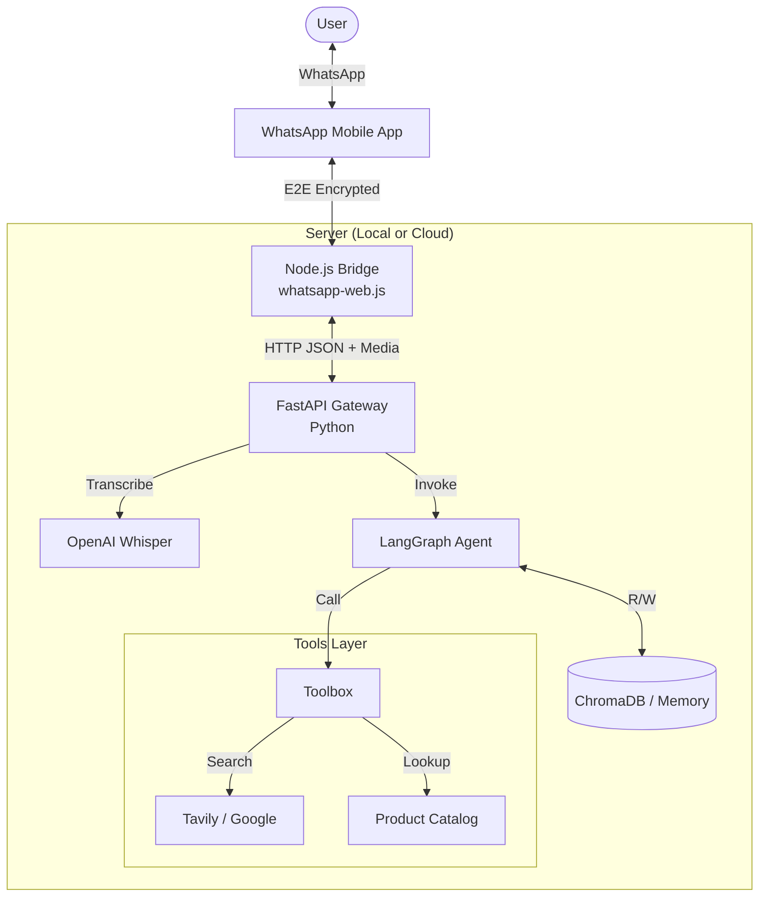
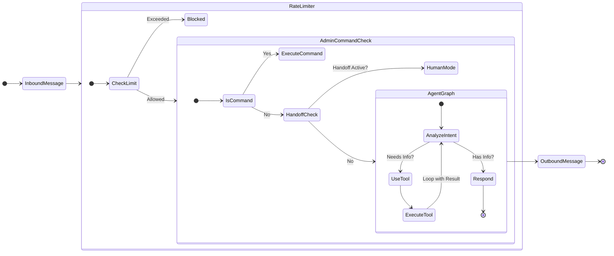

# AI-Powered Sales Multi-Agent System (WhatsApp & Messenger)

A sophisticated conversational commerce engine built with **LangChain**, **LangGraph**, and **FastAPI**. This system acts as an "Artificial Salesperson" capable of maintaining persistent negotiation states, reasoning about user intent, and executing omnichannel sales flows across WhatsApp and Facebook Messenger.

## 🚀 Key Features

- **WhatsApp Bridge**: Uses a local Node.js bridge (`whatsapp-web.js`) to control a real WhatsApp instance, avoiding Business API costs and approval delays.
- **Agentic Orchestration**: Uses **LangGraph** to handle complex, non-deterministic sales flows and stateful negotiations.
- **Persistent State**: Maintains user context, current product discussions, and negotiation stages across sessions.
- **Tool-Enabled Reasoning**: Equipped with tools for product lookup, inventory checks, and sending multimedia notifications.
- **RAG Integration**: Ready for Retrieval-Augmented Generation to provide accurate product information from structured catalogs.
- **Human-in-the-Loop**: Escalates to human agents via `/mute` command or sales detection.
- **Media Support**: Audio transcription (OpenAI Whisper), Image handling, and automatic media cleanup (TTL).
- **Context Aware**: Understands quoted messages and uses them as context.
- **Group Filter**: Automatically ignores group chats to focus on 1-on-1 customer service.
- **Safety First**: System is offline by default (`SYSTEM_ACTIVE=False`) and users are muted by default (`GLOBAL_MUTE_ALL=True`).

## 🏗️ Architecture

### High-Level Flow

The system uses a **Hybrid Architecture** where a Node.js process manages the real-time websocket connection to WhatsApp, while a Python process handles the intelligence, state management, and reasoning.



### 📂 Codebase Structure

| Directory / File | Description |
| :--- | :--- |
| **`app/`** | **Python Core Logic** (The Brain) |
| `app/agent/` | Contains the LangGraph definition. |
| &nbsp;&nbsp; ├── `graph.py` | Defines the StateGraph, nodes, and edges (the "wiring"). |
| &nbsp;&nbsp; ├── `nodes.py` | Implements the logic for each step (chatbot, call_tool, etc.). |
| &nbsp;&nbsp; └── `state.py` | Defines the `SalesState` (conversation history, variables). |
| `app/gateways/` | **I/O Layer** - Adapters for message conversion. |
| &nbsp;&nbsp; ├── `http_adapter.py` | Normalizes incoming JSON from Node.js into internal objects. |
| &nbsp;&nbsp; └── `bridge_client.py` | Client for sending text/media back to the Node.js Bridge. |
| `app/tools/` | **Capabilities** - Functions the agent can call. |
| &nbsp;&nbsp; ├── `product_tools.py` | RAG implementation (matches query to product info). |
| &nbsp;&nbsp; ├── `search_tools.py` | External web search for broader context. |
| &nbsp;&nbsp; └── `notification_tools.py` | Escalation logic (notifying human admins). |
| `app/utils/` | **Utilities** - Helpers. |
| &nbsp;&nbsp; ├── `media_processor.py` | Audio transcription and file cleanup. |
| &nbsp;&nbsp; ├── `logger.py` | Centralized structured logging. |
| `app/main.py` | **Entry Point** - FastAPI app, Webhook handler, and Rate Limiter. |
| | |
| **`whatsapp-gateway/`** | **Node.js Bridge** ( The Body) |
| `whatsapp-gateway/index.js` | Runs the headless Chrome/Puppeteer instance to connect to WhatsApp Web. |
| | |
| **`tests/`** | **Verification** |
| `tests/test_e2e_flows.py` | End-to-End simulation of sales conversations. |
| `tests/test_gateway.py` | Unit tests for the HTTP Adapter layer. |

## 🧠 Agent Logic Flow



## 🛠️ Tech Stack

- **Framework**: [FastAPI](https://fastapi.tiangolo.com/)
- **AI Orchestration**: [LangGraph](https://python.langchain.com/docs/langgraph) & [LangChain](https://python.langchain.com/)
- **Messaging Gateway**: Node.js + [whatsapp-web.js](https://wwebjs.dev/)
- **Models**: OpenAI (GPT-4o / Whisper-1)
- **Database**: SQL-based persistence (PostgreSQL recommended)

## 🎮 Admin & Control

The system includes built-in commands for human oversight. You can send these commands from your own WhatsApp number (defined in `ADMIN_WHATSAPP_NUMBER`) to control the system or specific user threads.

### Commands

| Command | Description |
| :--- | :--- |
| `/activate [target]` | **Enable** the AI agent for a user. (Aliases: `/unmute`) |
| `/deactivate [target]` | **Disable** the AI agent for a user. (Aliases: `/mute`) |
| `/mute-all` | **Global**: Set new users to be Muted by default. |
| `/unmute-all` | **Global**: Set new users to be Active by default. |
| `/status [target]` | Check status. Use `/status all` to list all users. |
| `/stop` | **Global Kill Switch**. Stops the AI for ALL users immediately. |
| `/start` | **Global Resume**. Reactivates the system (sets `SYSTEM_ACTIVE=True`). |
| `/help` | List available commands. |

### ⚠️ Important Behaviors

1.  **Safety First**: The system starts with `SYSTEM_ACTIVE=False` (Offline) and `GLOBAL_MUTE_ALL=True` (Muted).
2.  **Activation**: You must send `/start` to bring the system online, and `/unmute-all` (or `/activate` per user) to allow AI replies.
3.  **Media Cleanup**: Downloaded media files are automatically deleted after 24 hours (configurable) to save space. Audio files are deleted immediately after transcription.
4.  **Groups Ignored**: The system automatically ignores all messages from group chats (`@g.us`).
5.  **Remote Control**: Admin commands can specify a target phone number (e.g., `/mute 1234567890`) to control other chats remotely.
6.  **Authorization**: Only the phone number configured in `.env` (`ADMIN_WHATSAPP_NUMBER`) can execute admin commands.

## 🚦 Getting Started

### Prerequisites

- Python 3.11+
- Node.js 18+ (for the Bridge)
- OpenAI API Key

### Installation

### Installation (Automated)

1. Clone the repository:

   ```bash
   git clone https://github.com/Juanpa0128j/-AI-Powered-Sales-MultiAgent-System-WhatsApp-Messenger.git
   cd AI-Powered-Sales-MultiAgent-System-WhatsApp-Messenger
   ```

2. **One-Command Setup**:
   
   Run the following to install all Python/Node.js dependencies and create your `.env` file:

   ```bash
   make setup
   ```

   *Note: Remember to edit `.env` and add your `OPENAI_API_KEY`.*

### Installation (Manual)

If you prefer manual setup:

<details>
<summary>Click to expand manual steps</summary>

1. **Python Setup**:

   ```bash
   uv sync
   ```

2. **Node.js Bridge Setup**:

   ```bash
   cd whatsapp-gateway && npm install
   ```

3. **Environment**:

   ```bash
   cp .env.example .env
   ```

</details>

### 🚀 Running the System

You need two terminals:

#### Terminal 1: The Brain (Python)

```bash
make run-backend
# Or: uv run uvicorn app.main:app --port 8000
```

#### Terminal 2: The Bridge (Node.js)

```bash
make run-bridge
# Or: cd whatsapp-gateway && node index.js
```

*Scan the QR Code that appears in this terminal using your WhatsApp Mobile App (Linked Devices).*

## 📝 Roadmap

- [x] Integrate Vector Database for semantic product search.
- [x] Basic Multimedia response support (System Prompt).
- [x] **Bridge Enhancement**: Support sending images/video files via Node.js Bridge.
- [x] **Bridge Enhancement**: Auto-reconnection logic (handled via `LocalAuth`).
- [ ] Develop a Dashboard for real-time monitoring of agent performance.
- [ ] Dockerize the Node.js Bridge for easier deployment.

## 📄 License

This project is licensed under the MIT License - see the LICENSE file for details.
